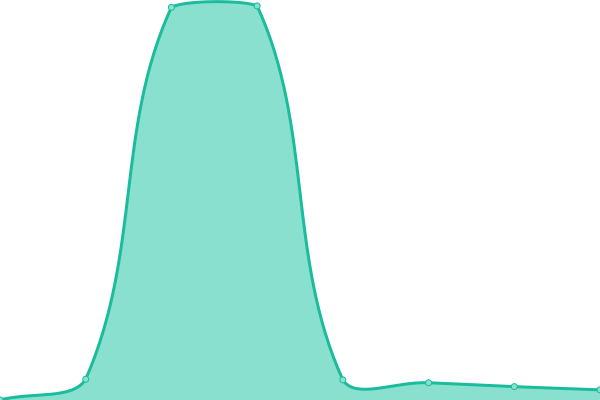

# [📈 Live Status](https://status.boufin.com): <!--live status--> **🟧 Partial outage**

This repository contains the open-source uptime monitor and status page for [Synaptic](https://www.synaptic.cl), powered by [Upptime](https://github.com/upptime/upptime).

With [Upptime](https://upptime.js.org), you can get your own unlimited and free uptime monitor and status page, powered entirely by a GitHub repository. We use [Issues](https://github.com/synaptic-cl/BOUFIN-uptime/issues) as incident reports, [Actions](https://github.com/synaptic-cl/BOUFIN-uptime/actions) as uptime monitors, and [Pages](https://status.boufin.com) for the status page.

<!--start: status pages-->
<!-- This summary is generated by Upptime (https://github.com/upptime/upptime) -->
<!-- Do not edit this manually, your changes will be overwritten -->
<!-- prettier-ignore -->
| URL | Status | History | Response Time | Uptime |
| --- | ------ | ------- | ------------- | ------ |
|  [Synaptic.cl](https://synaptic.cl/) | 🟩 Up | [synaptic-cl.yml](https://github.com/synaptic-cl/BOUFIN-uptime/commits/HEAD/history/synaptic-cl.yml) | 

 591ms
     
 | 

<a href="https://status.boufin.com/history/synaptic-cl">100.00%</a>
    

|  [Boufin.com](https://boufin.com/) | 🟩 Up | [boufin-com.yml](https://github.com/synaptic-cl/BOUFIN-uptime/commits/HEAD/history/boufin-com.yml) | 

 426ms
     
 | 

<a href="https://status.boufin.com/history/boufin-com">100.00%</a>
    

|  [Boufin.app](https://boufin.app/) | 🟥 Down | [boufin-app.yml](https://github.com/synaptic-cl/BOUFIN-uptime/commits/HEAD/history/boufin-app.yml) | 

 231ms
     
 | 

<a href="https://status.boufin.com/history/boufin-app">100.00%</a>
    

|  [Boufin Finance](https://api.boufin.app) | 🟩 Up | [boufin-finance.yml](https://github.com/synaptic-cl/BOUFIN-uptime/commits/HEAD/history/boufin-finance.yml) | 

 180ms
     
 | 

<a href="https://status.boufin.com/history/boufin-finance">100.00%</a>
    

|  [Boufin Finance Staging](https://api-staging.boufin.app) | 🟩 Up | [boufin-finance-staging.yml](https://github.com/synaptic-cl/BOUFIN-uptime/commits/HEAD/history/boufin-finance-staging.yml) | 

 158ms
     
 | 

<a href="https://status.boufin.com/history/boufin-finance-staging">100.00%</a>
    

|  [Boufin Docs](https://doc.boufin.com/) | 🟩 Up | [boufin-docs.yml](https://github.com/synaptic-cl/BOUFIN-uptime/commits/HEAD/history/boufin-docs.yml) | 

 219ms
     
 | 

<a href="https://status.boufin.com/history/boufin-docs">100.00%</a>
    

|  [Widget](https://widget.boufin.com/) | 🟩 Up | [widget.yml](https://github.com/synaptic-cl/BOUFIN-uptime/commits/HEAD/history/widget.yml) | 

 430ms
     
 | 

<a href="https://status.boufin.com/history/widget">100.00%</a>
    

|  [Widget DEMO](https://demo-widget.boufin.com/) | 🟩 Up | [widget-demo.yml](https://github.com/synaptic-cl/BOUFIN-uptime/commits/HEAD/history/widget-demo.yml) | 

 256ms
     
 | 

<a href="https://status.boufin.com/history/widget-demo">100.00%</a>
    

|  [Widget SandBox](https://widget-sandbox.boufin.com/) | 🟩 Up | [widget-sand-box.yml](https://github.com/synaptic-cl/BOUFIN-uptime/commits/HEAD/history/widget-sand-box.yml) | 

 212ms
     
 | 

<a href="https://status.boufin.com/history/widget-sand-box">100.00%</a>
    

|  [Widget SandBox DEMO](https://demo-widget-sandbox.boufin.com/) | 🟩 Up | [widget-sand-box-demo.yml](https://github.com/synaptic-cl/BOUFIN-uptime/commits/HEAD/history/widget-sand-box-demo.yml) | 

 237ms
     
 | 

<a href="https://status.boufin.com/history/widget-sand-box-demo">100.00%</a>
    

|  [Boufin Indicadores Económicos](https://finance.boufin.app/api/v1/indicators.json) | 🟩 Up | [boufin-indicadores-economicos.yml](https://github.com/synaptic-cl/BOUFIN-uptime/commits/HEAD/history/boufin-indicadores-economicos.yml) | 

 180ms
     
 | 

<a href="https://status.boufin.com/history/boufin-indicadores-economicos">100.00%</a>
    

<!--end: status pages-->

[**Visit our status website →**](https://status.boufin.com)

## 📄 License

- Powered by: [Upptime](https://github.com/upptime/upptime)
- Code: [MIT](./LICENSE) © [Synaptic](https://www.synaptic.cl)
- Data in the `./history` directory: [Open Database License](https://opendatacommons.org/licenses/odbl/1-0/)
